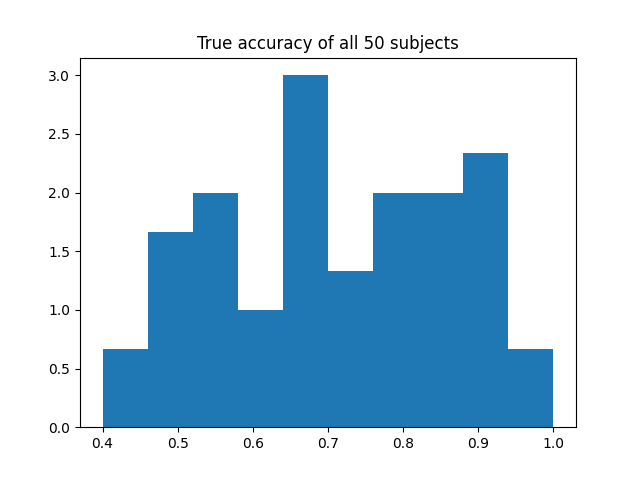
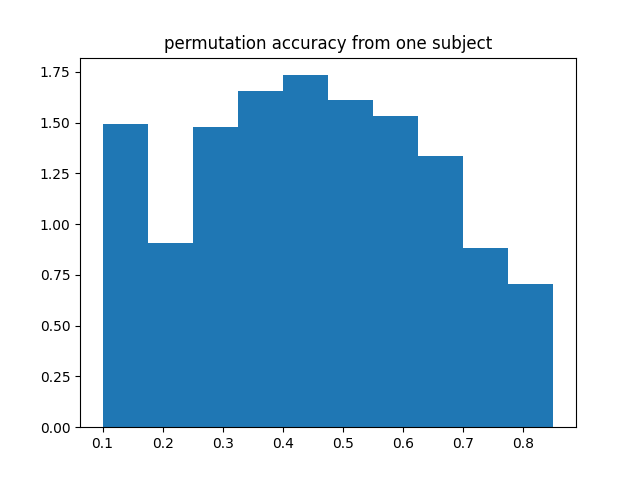
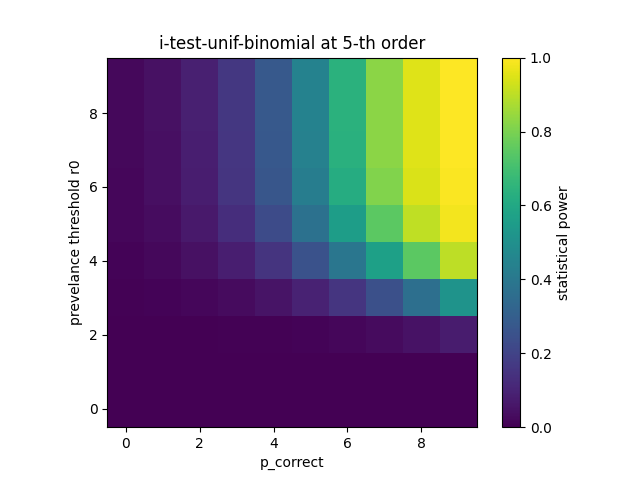
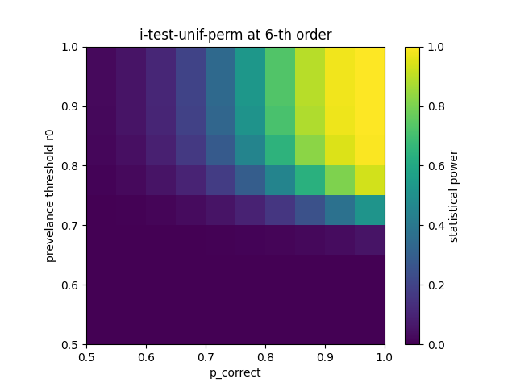

# Implementation of ith-order statistic (i-test) for fMRI decoding accuracy

## reference paper:

Hirose S. (2021). Valid and powerful second-level group statistics for decoding accuracy: Information prevalence inference using the i-th order statistic (i-test). NeuroImage, 242, 118456. https://doi.org/10.1016/j.neuroimage.2021.118456

## Implemented:

1. 
**i-test-unif-binom** : assuming whether a trial or a subject is decodable follows
a binomial distribution, probability of decoding scores lower than threshold
in trials without label information is built with a binomial distribution. 

```
P(scores < threshold | p_chance) = binomial([scores*threshold]*, N_trial, p)

[X]* indicates the largest integer less than X
```

2.
**i-test-unif-perm** : probability of decoding scores lowder than threshold in
trials without label information is built with permutation test for each
subject

```
P(scores < threshold | p_chance) = 1/(N*M)* sum(permute_scores_{n,m} < threshold))

N: number of subjects
M: number of permutations
```

## Example:

1. Simulating 50 subjects, each associate with an accuracy score and 1000 permutations 

  
*Simulate accuracy scores for 50 subjects*

  
*Simulate 1000 permutations, the distribution of accuracy scores without label
information for subject 4*

2. Plot statistic power given different prevalance value `r0 [0.5,1.0]` and
   probability at chance level `p_chance`

  
*Example of using binomial distribution: statstic power with different pervalence value and probability of correctly classified*

  
*Example of using permutation test: statstic power with different pervalence value and probability of
correctly classified*


3. Numerically estimate the expectation of power given all `r0` and `p_chance`

```
i - 1, T - 0.3076923076923077, power - 9.997523004313866
i - 2, T - 0.3076923076923077, power - 23.90166720736957
i - 3, T - 0.38461538461538464, power - 18.879334126439176
i - 4, T - 0.38461538461538464, power - 27.369179087135226
i - 5, T - 0.46153846153846156, power - 18.82136698708326
i - 6, T - 0.46153846153846156, power - 24.08311303374316
```

4. The result of 2nd-level group test

```
acc_i: 0.499573710810515
Lower bound 0.0003654499011156344 < 0.05, reject null, significant
Alternatively: using binomial distribution
binomial lower bound 2.8064773123740115e-05 < 0.05, significant
```
